# 📱 Rapport de Laboratoire : Analyse statique d'un APK avec JADX GUI + dex2jar + JD-GUI
**Étudiant :** Ali Benrioui  
**Projet :** Analyse statique complète - OWASP UnCrackable Level 1  
**Plateforme :** Mobexler Pentest VM  

---

## 📋 Introduction
Ce dépôt documente l'audit de sécurité de l'application **UnCrackable-Level1.apk**. L'objectif est de mettre en pratique les techniques de reverse engineering pour contourner les protections anti-root et extraire des secrets cryptographiques.

---

## 🛠️ Task 1 & 2 : Préparation et Intégrité

### 1.1 Mise en place de l'environnement
Nous commençons par préparer le répertoire de travail dans la VM Mobexler. Le fichier APK est déplacé depuis le dossier de téléchargement vers un dossier projet dédié.

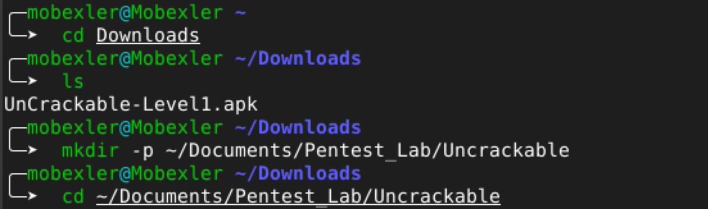
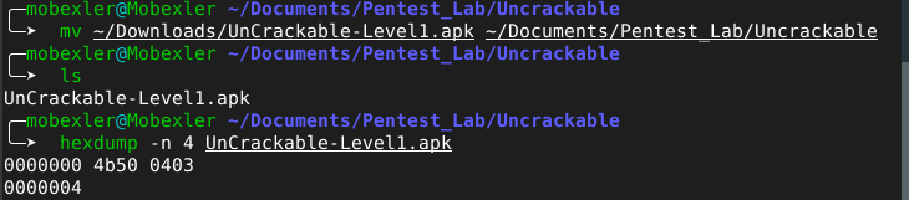

### 1.2 Validation de l'intégrité (SHA-256)
Pour garantir que l'APK n'a pas été modifié, nous calculons son empreinte numérique.
**Hash SHA-256 :** `1da8bf57d266109f9a07c01bf7111a1975ce01f190b9d914bcd3ae3dbef96f21`

### 1.3 Analyse de la structure ZIP
Un APK étant une archive, la commande `hexdump` permet de vérifier les premiers octets (Magic Number). La présence de `4b50 0403` (signature PK) confirme qu'il s'agit d'une archive valide. Nous listons ensuite le contenu pour identifier le fichier de code `classes.dex`.

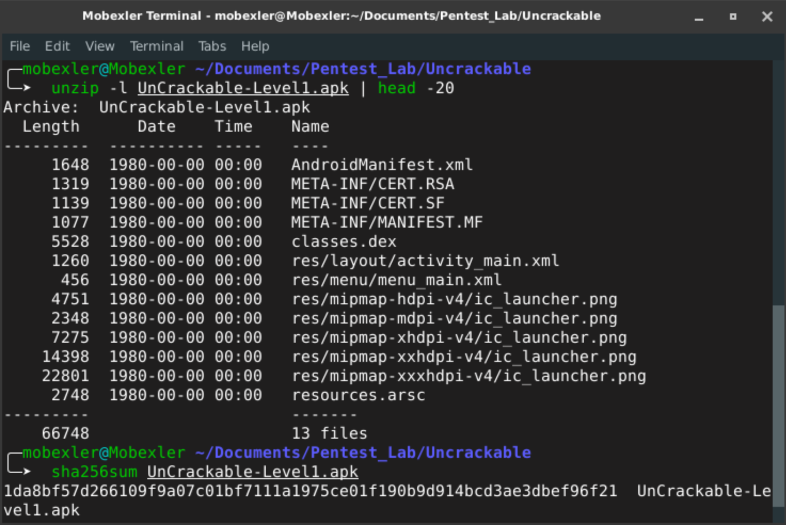

---

## 🔍 Task 3 : Décompilation et Analyse du Manifeste (JADX-GUI)

### 3.1 Analyse du fichier AndroidManifest.xml
L'ouverture dans **JADX-GUI** permet d'analyser les permissions et les composants. On note que `android:allowBackup` est réglé sur `true`, ce qui expose les données locales à une extraction via ADB.

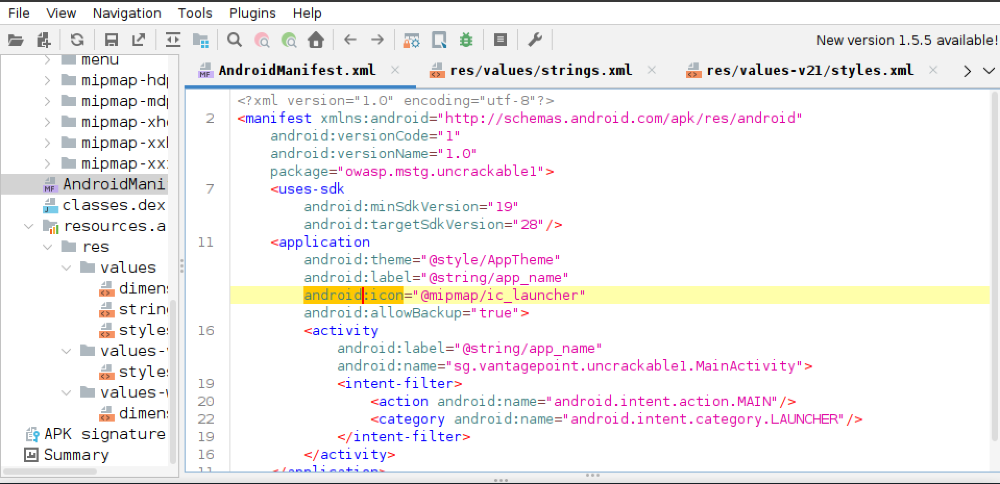

### 3.2 Exploration de l'arborescence source
JADX-GUI reconstruit la structure du projet, montrant les packages de code et les ressources. On identifie le package `sg.vantagepoint` comme contenant les utilitaires de sécurité.

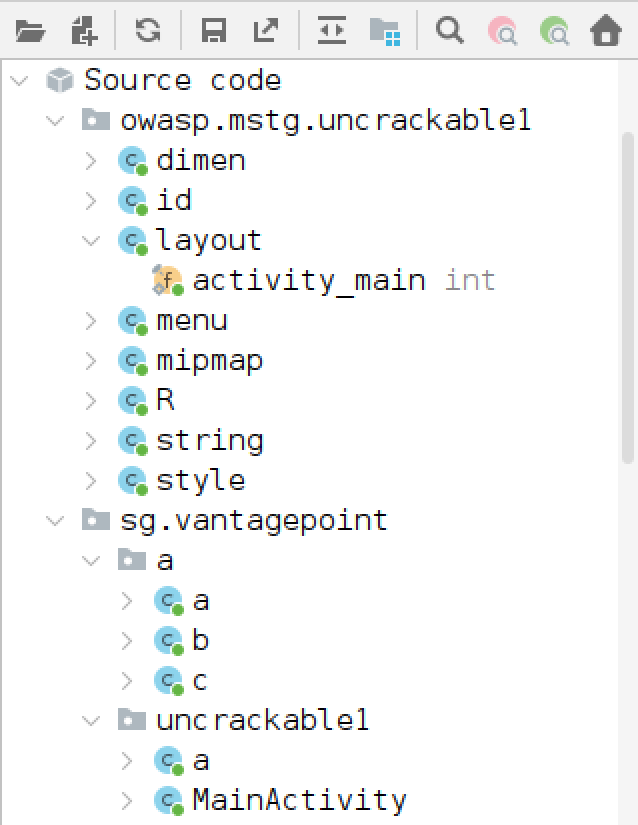
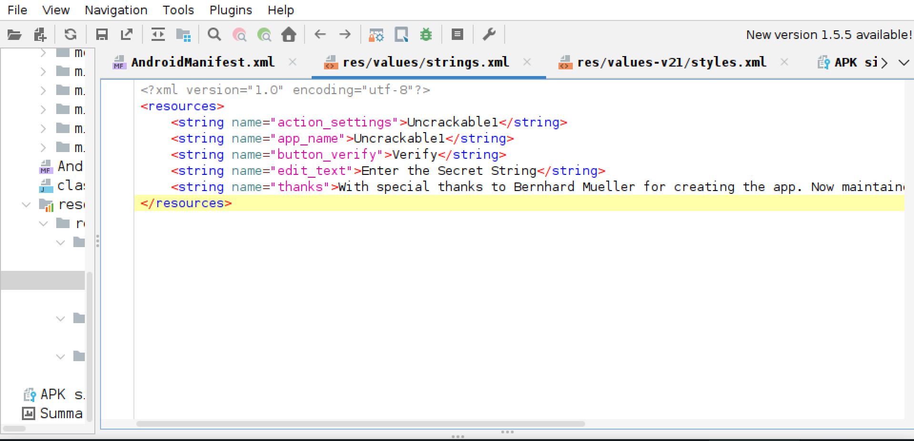

---

## 🔐 Task 4 : Analyse de la Logique de Sécurité

### 4.1 Mécanismes Anti-Root et Anti-Debug
L'application implémente des contrôles au démarrage dans `MainActivity`. Elle vérifie la présence du binaire `su` et l'état du debugger. Si une menace est détectée, l'application affiche un message et se ferme.

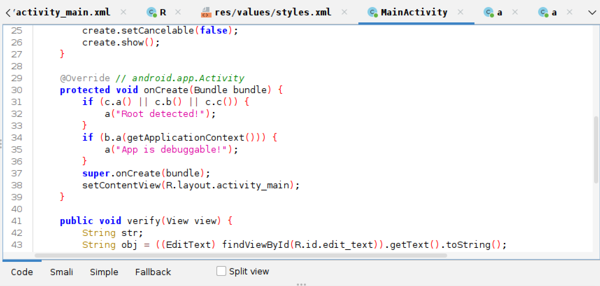

### 4.2 Extraction des Secrets Cryptographiques
Une recherche textuelle sur le terme "secret" révèle l'usage de l'algorithme `AES/ECB/PKCS7Padding`. La classe `sg.vantagepoint.uncrackable1.a` contient les éléments critiques :

* **Clé AES (Hex) :** `8d127684cbc37c17616d806cf50473cc`
* **Secret (Base64) :** `5UJiFctbmgbDoLXmpL12mkno8HT4Lv8dlat8FxR2GOc=`

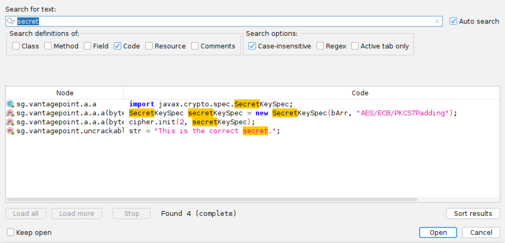
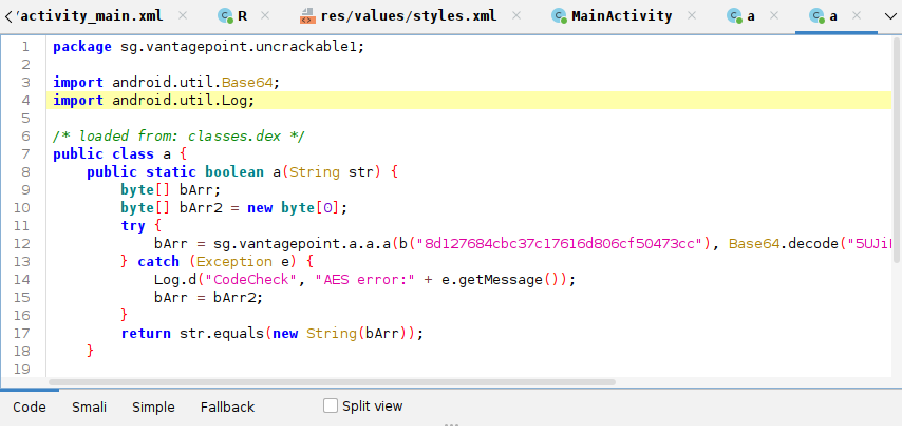

---

## ⚙️ Task 5 : Conversion du Bytecode (dex2jar)

Pour confirmer nos résultats, nous extrayons le `classes.dex` et utilisons `d2j-dex2jar` pour le convertir en un fichier JAR standard, compatible avec les outils Java classiques.

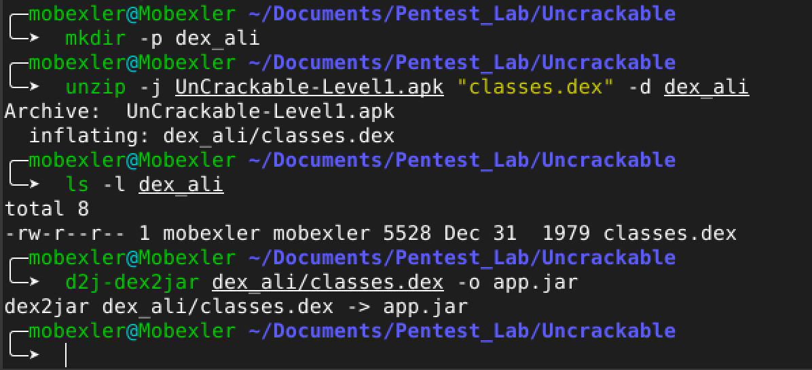

---

## 🔄 Task 6 : Analyse Comparative avec JD-GUI

###  Utilisation de Java Decompiler (JD-GUI)
L'ouverture du fichier `app.jar` généré montre une vue différente. JD-GUI ne gère pas les ressources Android (XML), affichant des IDs numériques à la place des noms de ressources.

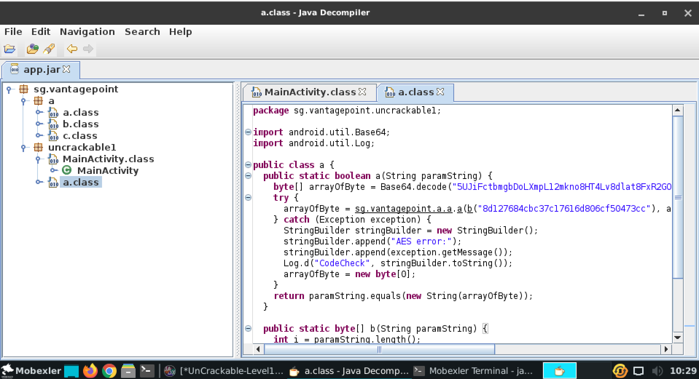

---

## 🏁 Task 7 : Conclusion du Lab
L'analyse statique a permis de découvrir que l'application repose sur une sécurité "par l'obscurité". Malgré les tests anti-root, les secrets sont exposés en clair dans le code décompilé.

**Recommandations :**
1. Utiliser ProGuard/DexGuard pour l'obfuscation.
2. Stocker les clés de chiffrement dans le Android Keystore System.
